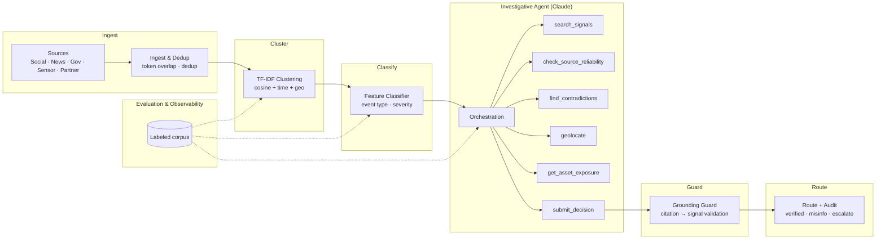

# Samdesk Demo by Aryan

A portfolio demo built for a real-time disruption and crisis monitoring company. It mirrors a "Detect → Analyze" intelligence pipeline whose centerpiece is an **autonomous investigative agent** using real Anthropic tool use — verifying incidents the way a human security analyst would.

**Built by Aryan** · [GitHub](https://github.com/aryankumar2811) · [LinkedIn](https://www.linkedin.com/in/aryan-kumar-10a548297/)

> All data is synthetic and clearly labeled as such. All LLM calls are real and hit the Anthropic API.

---

## Architecture



---

## Setup

### 1. Clone and install

```bash
git clone https://github.com/aryankumar2811/samdesk_demo
cd samdesk_demo
npm install
```

### 2. Set your API key

```bash
cp .env.local.example .env.local
# Edit .env.local and set:
# ANTHROPIC_API_KEY=your_key_here
```

### 3. Run

```bash
npm run dev
```

Open [http://localhost:3000](http://localhost:3000).

---

## Deploy to Vercel

1. Push to GitHub
2. Import the repo in [Vercel](https://vercel.com/new)
3. Add `ANTHROPIC_API_KEY` as an environment variable
4. Deploy

No other configuration needed.

---

## Cost note

The agent loop uses `claude-sonnet-4-6` by default. Each agent run is 2–8 tool calls plus reasoning — roughly $0.005–0.02 per full run. The eval endpoint runs 3 live agent runs over demo scenarios; expect ~$0.05 per eval trigger. Swap `MODEL` in `src/lib/agent/loop.ts` to `claude-opus-4-8` for higher-quality briefs at ~5× cost.

---

## How this maps to the role

| Demo feature | Role responsibility |
|---|---|
| Autonomous agent with real Anthropic tool use, streamed live | *"Building and operating AI agents with tool use and multi-step reasoning"* |
| Clustering (TF-IDF + time + geo) → classification pipeline | *"Structured ML pipeline over streaming signal data"* |
| Grounding guard: every brief claim mapped to a signal ID | *"Auditability and provenance for LLM outputs"* |
| Evaluation rail: P/R/F1 + decision accuracy + false-verify rate + grounding faithfulness + p50/p95 latency | *"Rigorous evaluation; measurable quality bar for every model change"* |
| Human-review queue for escalated incidents | *"Human-in-the-loop for high-stakes decisions"* |
| In Production section: provider abstraction, model routing, SFT roadmap, drift monitoring | *"Provider-agnostic LLM infrastructure; fine-tuning domain models; observability"* |
| Roadmap: Phase 3 = SFT + preference optimization + automated version gating | *"Each new model version must measurably beat the last"* |
| Roadmap: Phase 4 = multimodal, FedRAMP, predictive | *"Anticipate; multimodal; compliance-grade deployment"* |

---

## What the classifier actually is

The classifier in `src/lib/pipeline/classify.ts` is a **feature lexicon scorer** — essentially a keyword-weighted multi-label model. In production this would be replaced by a fine-tuned transformer trained on analyst-verified alert data. The README and UI both state this explicitly. The Phase 3 roadmap item covers that transition (SFT + preference optimization + automated version gating).

## Real data slot-in

To connect real data, replace:
- `src/data/signals.ts` → stream from Kafka/SQS consumer; persist to vector DB
- Tool implementations in `src/lib/agent/tools.ts` → call internal microservices
- `src/app/api/pipeline/route.ts` → run in a background worker, cache results
- `src/app/api/eval/route.ts` → run continuously against a growing labeled set

The agent loop, tool schemas, grounding guard, and streaming API layer require no changes.

---

## Project structure

```
src/
  data/           Synthetic fixtures (sources, signals, incidents, assets)
  lib/
    agent/        Agent loop, tool schemas, tool implementations, prompts
    pipeline/     Clustering, classification, evaluation harness
  app/
    api/          Server-side API routes (agent stream, eval, pipeline)
    page.tsx      Single-page app with all four sections
  components/
    layout/       Nav, Footer
    sections/     Overview, Demo, Production, Roadmap
    ui/           StatusBadge, MotionSection, SocialIcons
```
